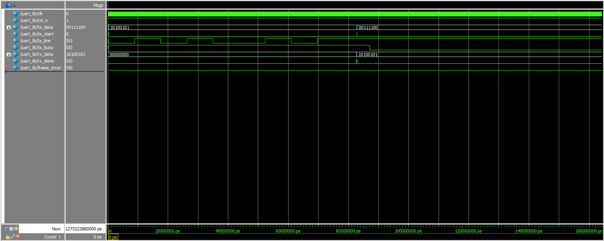

# UART 8N1 Transceiver — Verilog

A fully parameterised, synthesisable UART transceiver written in Verilog. Implements the standard 8N1 protocol (1 start bit, 8 data bits, no parity, 1 stop bit) and includes a self-checking loopback testbench.

## Features

- Parameterised clock frequency and baud rate — no hardcoded timing
- Transmitter with `tx_busy` handshake signal
- Receiver with mid-bit sampling for noise immunity
- Two-stage input synchroniser for clock-domain crossing
- Framing error detection on invalid stop bit
- Self-checking loopback testbench with PASS/FAIL output per byte
- VCD waveform dump for inspection in GTKWave

## File Structure

```
├── UART.v       # UART Transmitter
├── UART_RX.v       # UART Receiver
├── UART_top.v      # Top-level wrapper (instantiates TX + RX)
└── UART_tb.v       # Loopback testbench
```

---

## Parameters

| Parameter   | Default        | Description                        |
|-------------|----------------|------------------------------------|
| `CLK_FREQ`  | `50_000_000`   | System clock frequency in Hz       |
| `BAUD_RATE` | `115200`       | Desired baud rate in bps           |

The baud clock divider is computed automatically:

```
CLKS_PER_BIT = CLK_FREQ / BAUD_RATE
```

---

## Module Overview

### `uart_tx`
Serialises an 8-bit input byte over the `tx` line in 8N1 format.

- Assert `tx_start` for one clock cycle to begin transmission
- `tx_busy` stays high for the entire transmission duration
- Data is latched on the rising edge of `tx_start` — safe to change `data_in` after

**State machine:** `IDLE → START → DATA (×8) → STOP → IDLE`

### `uart_rx`
Deserialises an incoming 8N1 serial stream.

- Detects start bit on falling edge of `rx`
- Waits half a bit period, then samples at the centre of each subsequent bit
- Pulses `rx_done` high for one clock cycle when a full byte is ready
- Asserts `frame_error` if the stop bit is not logic high

**State machine:** `IDLE → START → DATA (×8) → STOP → IDLE`

### `uart_top`
Thin wrapper that instantiates `uart_tx` and `uart_rx` with shared `CLK_FREQ` and `BAUD_RATE` parameters. Add your own FIFO or flow-control logic on top of this.

---
### `output waveform`



